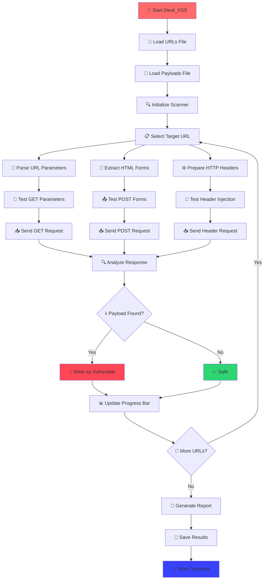

<div align="center">
  
  
  <br/><br/>
  
  
  <h1>👹 Devil_XSS 👹</h1>
  <h3>Advanced XSS Vulnerability Scanner</h3>
  <p><strong>Find all Cross-Site Scripting vulnerabilities</strong></p>
</div>

## 🔍 Overview
Devil_Xss is a comprehensive Python-based CLI tool designed for detecting XSS (Cross-Site Scripting) vulnerabilities in web applications. The tool performs automated testing using custom payloads and supports multiple attack vectors with advanced detection mechanisms.

## 🛡️ How XSS Detection Works

### Understanding Cross-Site Scripting (XSS)
XSS vulnerabilities occur when web applications fail to properly sanitize user input, allowing attackers to inject malicious scripts that execute in other users' browsers. Devil_XSS uses sophisticated detection techniques to identify these vulnerabilities.

### 🔬 Detection Methodology

#### 1. **Reflected XSS Detection (GET Method)**
- **Process**: Injects payloads into URL parameters and monitors response
- **Technique**: Modifies query parameters with malicious scripts
- **Detection**: Checks if payload appears unmodified in HTTP response
- **Example**: `https://target.com/search?q=<script>alert('XSS')</script>`

#### 2. **Reflected XSS Detection (POST Method)**
- **Process**: Discovers web forms and tests form inputs
- **Technique**: Analyzes HTML forms, extracts input fields, and submits malicious data
- **Detection**: Monitors response for payload reflection
- **Advanced**: Supports both POST and GET form methods

#### 3. **Header Injection XSS**
- **Process**: Tests HTTP headers for XSS vulnerabilities
- **Headers Tested**: User-Agent, Referer, X-Forwarded-For
- **Detection**: Checks if header values are reflected in page content
- **Use Case**: Identifies server-side header processing vulnerabilities

#### 4. **Multi-Vector Testing**
- **Comprehensive**: Tests all possible injection points simultaneously
- **Smart**: Uses session management for consistent testing
- **Efficient**: Implements timeout handling and error recovery

### 🎯 Vulnerability Classification

| Type | Method | Injection Point | Detection Rate |
|------|--------|----------------|----------------|
| Reflected XSS | GET | URL Parameters | High |
| Reflected XSS | POST | Form Inputs | High |
| Header XSS | GET | HTTP Headers | Medium |

### 🔍 Detection Algorithm
```
1. Load target URLs and payloads
2. For each URL:
   a. Parse URL parameters
   b. Extract form elements
   c. Test GET parameters with payloads
   d. Test POST form inputs with payloads
   e. Test HTTP headers with payloads
   f. Analyze response content for payload reflection
   g. Report vulnerabilities with detailed information
```

---

## 📊 XSS Scanning Process Flowchart



### 🔄 Process Flow Explanation

| Step | Description | Action |
|------|-------------|--------|
| **🚀 Initialization** | Load configuration and files | Parse command line arguments |
| **📁 File Loading** | Load target URLs and payloads | Validate file existence and format |
| **🔍 URL Processing** | Parse and analyze each target URL | Extract parameters, forms, and headers |
| **🎯 Payload Injection** | Test multiple injection vectors | GET, POST, and Header methods |
| **📥 Response Analysis** | Monitor HTTP responses | Check for payload reflection |
| **🚨 Vulnerability Detection** | Identify XSS vulnerabilities | Compare injected vs reflected content |
| **📊 Reporting** | Generate comprehensive reports | Save results with detailed information |

---

## 👨‍💻 Developer Information
- **Developed by:** S.Tamilselvan
- **GitHub:** https://github.com/Tamilselvan-S-Cyber-Security
- **Official Site:** https://tamilselvan-official.web.app/

## ✨ Key Features

### 🎨 **User Experience**
- 🎭 ASCII art banner with developer credits
- ⏳ Animated loading spinners for file operations
- 📊 Real-time progress bar with completion percentage
- 🎯 Target counter showing scan progress (e.g., [1/3], [2/3])
- 🌈 Color-coded console output for better readability
- 🎪 Clean, organized output with visual separators and icons

### 🔧 **Technical Capabilities**
- 🎯 Tests multiple XSS injection points: URL parameters, form inputs, headers
- 🌐 Supports multiple HTTP methods (GET, POST)
- 📡 Displays HTTP status codes for each test
- 🔍 Detects reflected XSS by checking payload presence in responses
- 📝 Generates comprehensive vulnerability reports
- 🛡️ Error handling for network issues and timeouts

### ⚙️ **Advanced Features**
- 🔄 Session management for consistent testing
- 📋 CLI argument parsing with -f (URL list), -p (payloads), -o (output file)
- 🎯 Smart form detection and analysis
- 📊 Detailed vulnerability classification and reporting
- 🚀 Multi-threaded scanning capabilities

## 🚀 Usage Guide

### 🎯 Devil_XSS - XSS Scanner
```bash
python devil_xss.py -f urls.txt -p payloads.txt -o results.txt
```

#### 📋 Command Line Arguments
| Argument | Description | Required |
|----------|-------------|----------|
| `-f, --file` | File containing list of URLs to test | ✅ Yes |
| `-p, --payloads` | File containing XSS payloads | ✅ Yes |
| `-o, --output` | Output file for vulnerable URLs | ✅ Yes |

### 🔍 URL Finder - URL Discovery Tool
```bash
python url_finder.py -u https://example.com -o discovered_urls.txt
```

#### 📋 Command Line Arguments
| Argument | Description | Required |
|----------|-------------|----------|
| `-u, --url` | Target URL to scan for URLs | ✅ Yes |
| `-o, --output` | Output file to store discovered URLs | ✅ Yes |

### 🔄 Complete Workflow Example
```bash
# Step 1: Discover URLs from a website
python url_finder.py -u https://target-site.com -o urls.txt

# Step 2: Test discovered URLs for XSS vulnerabilities
python devil_xss.py -f urls.txt -p payloads.txt -o results.txt

# Step 3: Review the generated vulnerability report
cat results.txt
```

## 📁 Project Structure
```
DevilXSSScanner/
├── 👹 devil_xss.py          # Main XSS vulnerability scanner
├── 🔍 url_finder.py         # Advanced URL discovery tool
├── 🎯 payloads.txt          # Sample XSS payloads
├── 📝 wordlist.txt          # Wordlist for URL discovery
├── 📋 pyproject.toml        # Project dependencies
├── 📖 README.md             # Project documentation
└── 🐛 wolf-bug.txt          # Bug reports and issues
```

## 📈 Recent Updates

### 🆕 Latest Version Features
- **🎭 Enhanced UI**: Beautiful ASCII art banner with developer credits
- **⚡ Performance**: Real-time progress bar and animated loading spinners
- **🎯 Multi-Vector Testing**: GET, POST, and Header injection methods
- **🌈 Visual Output**: Color-coded console output with clean separators
- **📊 Smart Reporting**: Comprehensive vulnerability reports with detailed information
- **🔍 URL Discovery**: Automated URL extraction from HTML, JavaScript, and text content
- **📋 Advanced Analytics**: URL categorization (internal/external) and progress tracking

### 📅 Development Timeline
| Date | Feature | Description |
|------|---------|-------------|
| 2025-10-06 | Initial Release | Full XSS scanning capabilities |
| 2025-10-06 | Multi-Method Testing | GET, POST, and Header injection |
| 2025-10-06 | Enhanced UX | Color-coded output and progress bars |
| 2025-10-06 | URL Discovery | Automated URL extraction tool |
| 2025-10-06 | Advanced Reporting | Comprehensive vulnerability reports |

## 🔧 Technical Specifications

### 🐍 **System Requirements**
- **Language**: Python 3.11+
- **Platform**: Cross-platform (Windows, Linux, macOS)
- **Memory**: Minimum 512MB RAM
- **Network**: Internet connection for target scanning

### 📦 **Dependencies**
| Package | Version | Purpose |
|---------|---------|---------|
| `requests` | >=2.32.5 | HTTP requests and session management |
| `colorama` | >=0.4.6 | Cross-platform colored terminal text |
| `beautifulsoup4` | >=4.14.2 | HTML parsing and form extraction |

### 🎯 **Testing Capabilities**
- **Reflected XSS**: GET and POST method detection
- **Header Injection**: User-Agent, Referer, X-Forwarded-For
- **Form Analysis**: Automatic form detection and input testing
- **Session Management**: Persistent sessions for consistent testing
- **Error Handling**: Robust timeout and network error management

---

## ⚠️ Security Notice
> **⚠️ IMPORTANT**: This tool is designed for educational and authorized security testing purposes only. Always obtain proper written authorization before testing any web application. Unauthorized testing may violate laws and terms of service.

### 🛡️ **Ethical Guidelines**
- ✅ Use only on systems you own or have explicit permission to test
- ✅ Respect rate limits and server resources
- ✅ Report vulnerabilities responsibly through proper channels
- ❌ Never use for malicious purposes or unauthorized testing
- ❌ Do not test production systems without permission

---

<div align="center">
  <p><strong>Made with ❤️ by S.Tamilselvan</strong></p>
  <p>
    <a href="https://github.com/Tamilselvan-S-Cyber-Security">GitHub</a> •
    <a href="https://tamilselvan-official.web.app/">Official Site</a>
  </p>
</div>
